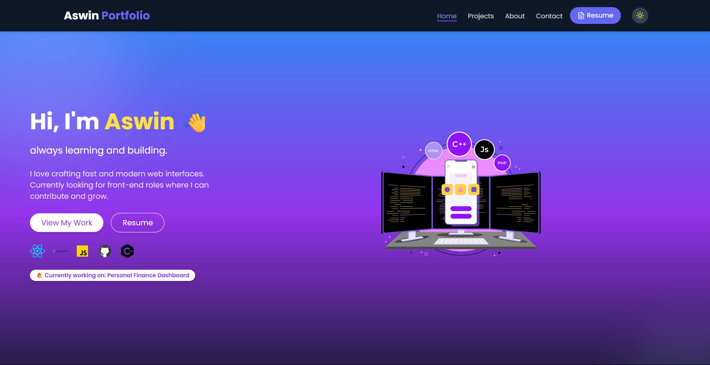

#  Aswin Thapa — Developer Portfolio 

Welcome to my **personal developer portfolio**, built to showcase my skills, projects, and resume as a frontend developer. This version is a polished, responsive, and interactive single-page site made using **React + Tailwind CSS**, with animations and modern UI enhancements.

 

---

##  Features

-  **Typewriter Hero Section** — Catchy introduction with dynamic typing animation.
-  **Dark Mode Toggle** — Seamless light/dark theme with persistent toggle.
-  **ScrollSpy Navigation** — Smooth scroll + active section highlighting.
-  **Projects Showcase** — Responsive project cards with GitHub/live demo links.
-  **Resume Download** — One-click PDF resume download button.
-  **Contact Form** — Reach out easily via a clean form or email link.
-  **Lottie Animation** — Clean dev-themed animation in hero section.
-  **Tech Icons** — Stack logos displayed elegantly in Home/About.

---

##  Tech Stack

| Layer       | Technologies                             |
|------------|------------------------------------------|
| Frontend    | React, Tailwind CSS, React Router (initial), Framer Motion |
| Animations  | Lottie (JSON-based), Typewriter          |
| Icons       | Lucide React Icons                       |
| Hosting     | GitHub Pages / Vercel (optional)         |

---

##  Future Improvements

-  Convert to full SPA using ScrollSpy and anchor linking
-  Add testimonials or a blog section
-  Deploy and track via Analytics
-  Integrate email service or Formspree

---

Thanks for stopping by!

