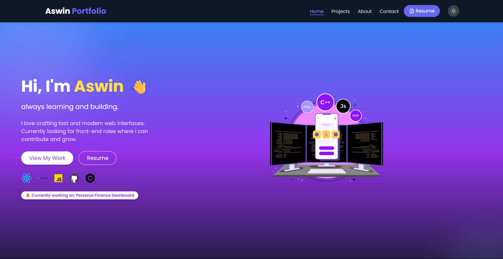

# 👋 Hey, I'm Aswin Thapa

Welcome to my personal portfolio — a place where I showcase what I do, what I love, and the projects I'm building as I learn and grow in tech.

This site is built using **React + Tailwind CSS** and is designed to be simple, clean, and responsive. I’ve added some nice touches like typewriter animations, smooth scrolling, and a dark mode toggle just to make it more “me”.

---

## 🌟 What You’ll Find

- **Hero Section** with a typewriter intro and a Lottie animation
- **Dark Mode** toggle for better viewing (and vibes)
- **Smooth Scroll Navigation** — scroll or click to move between sections
- **Project Cards** with GitHub links
- **About Me** section that tells you a bit about my journey
- **Contact Section** to reach out or just say hi!
- **Resume Download** button

---

## 🛠️ Tech I Used

- **React** — for all the components and routing
- **Tailwind CSS** — for fast and responsive UI
- **Framer Motion** — for some subtle animations
- **Lucide Icons** — clean and minimal icons
- **Lottie** — for the dev animation
- **Typewriter effect** — because it looks cool 😎

---

## 📸 A Quick Look

> 

---

## 🙋‍♂️ Why I Made This

I come from an **ECE background**, but I've always loved building things on the web. This portfolio is just one step in my learning journey as I try to get into the software industry. Every section you see here was built from scratch with a lot of trial, error, and caffeine ☕.

---

## 📬 Want to Connect?

- **GitHub**: [@AswinThApa04](https://github.com/AswinThApa04)
- **LinkedIn**: [linkedin.com/in/aswin-thapa](https://linkedin.com/in/aswin-thapa)
- **Mail me**: aswinthapa16@gmail.com

---

Thanks for stopping by!
